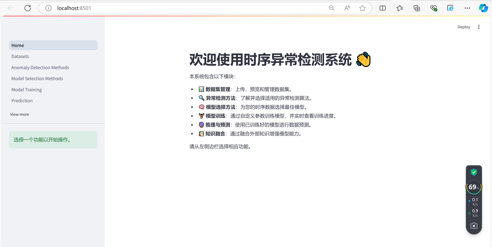
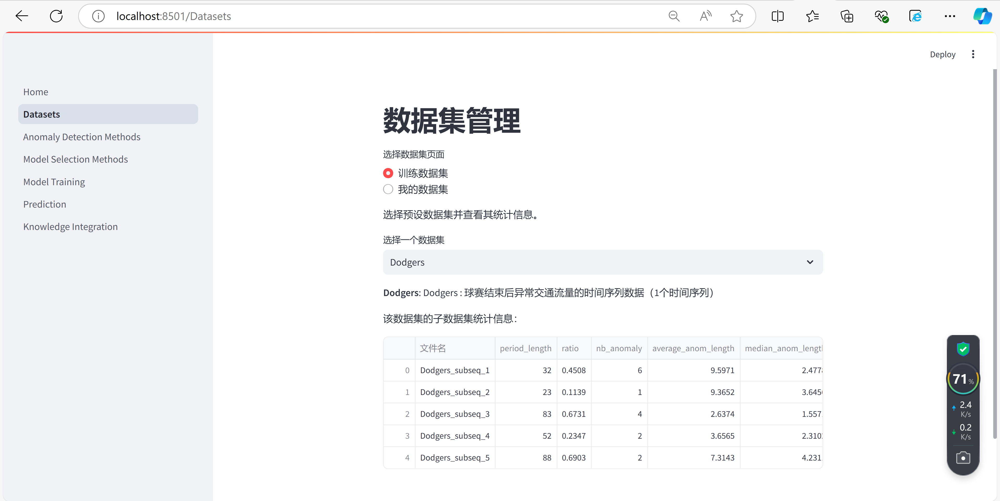
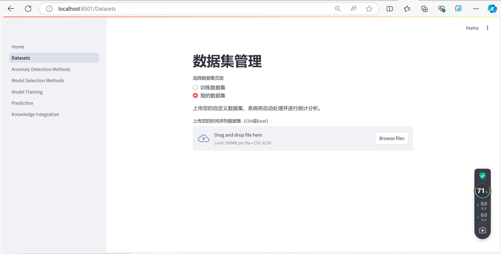
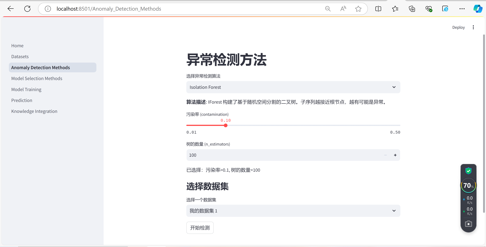
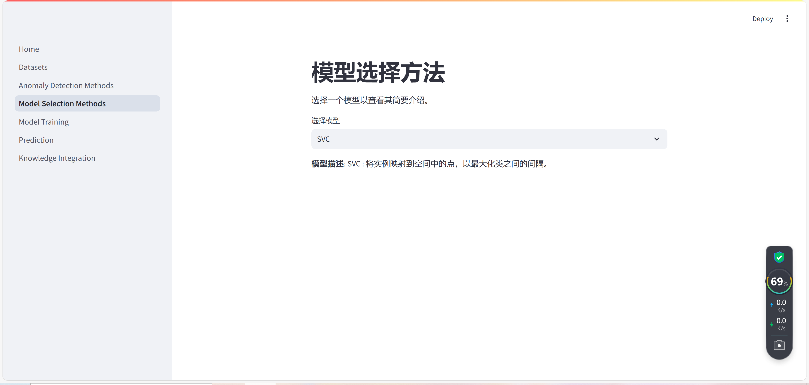
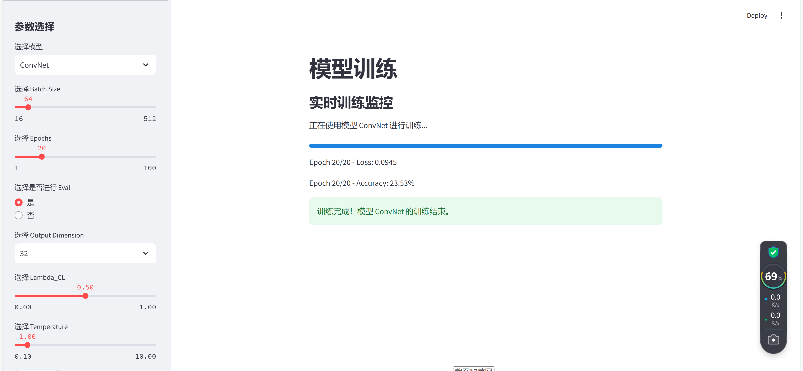
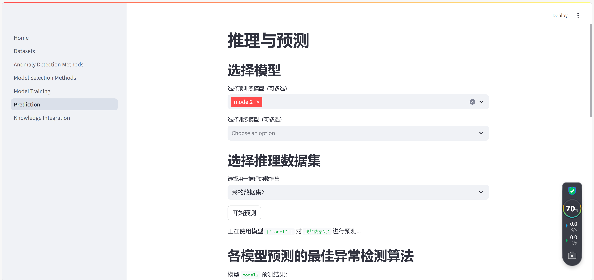

# 时序异常检测系统

时序异常检测系统是一个基于 Streamlit 的可视化平台，用于管理数据集、选择和训练异常检测算法自动选择模型、进行推理与预测以及展示外部知识增强模块的系统。
通过该系统，用户可以轻松上传数据、选择算法并执行模型训练推理，同时能够直观地展示异常检测结果。

## 目录
- [功能简介](#功能简介)
- [页面功能说明](#页面功能说明)
  - [Home 页面](#home-页面)
  - [数据集管理](#数据集管理)
  - [异常检测方法](#异常检测方法)
  - [模型选择方法](#模型选择方法)
  - [模型训练](#模型训练)
  - [推理与预测](#推理与预测)
  - [知识融合模块](#知识融合模块)
- [运行指南](#运行指南)

---

## 功能简介
本系统的核心功能包括：
- **数据集管理**：上传并管理时序数据集，支持预定义的实验数据集和用户自定义数据集，并且可以对数据集的统计特征进行查看。
- **异常检测方法**：提供 12 种异常检测算法，用户可以根据需求选择异常检测算法并进行参数配置，并且选择数据集进行异常检测。
- **模型训练方法**：用户可以选择合适的分类模型进行算法训练。
- **模型训练**：用户可以进行参数选择，训练模型并实时查看 loss 和 accuracy等训练结果。
- **推理与预测**：使用用户自己训练好的模型或者预训练的模型进行推理，并通过多数投票得出最佳的异常检测算法。
- **知识融合**：通过将外部领域知识与时序数据相结合，提升算法的精度与适应性。

---


## 页面功能说明

### Home
**Home** 页面提供了系统主要功能模块的概述，并引导用户从侧边栏选择相应的功能操作。

---

### 数据集管理
该页面用于管理时序数据集，支持从预设的 16 个数据集中选择或上传自定义数据集。

#### 功能：
- **训练数据集**：选择并查看 16 个预设数据集的统计信息，包括文件名、周期长度、异常比率等。
- **我的数据集**：支持用户上传 CSV 或 Excel 格式的自定义时序数据集，并进行数据统计分析。


---

### 异常检测方法
用户可以从 12 种异常检测算法中选择，并根据具体需求配置算法的参数。用户还可以选择数据集并开始检测。

#### 功能：
- **算法选择**：12 种算法的详细说明，包括 Isolation Forest、LSTM-AD 等。
- **参数调整**：根据所选算法提供不同的参数调整功能。
- **数据集选择与检测**：选择“我的数据集”，并进行异常检测。


---

### 模型选择方法
该页面用于为时序数据选择最佳的模型。

#### 功能：
- **模型选择**：用户可以从 SVC、Bayes、MLP 等多个模型中选择一个适合的模型，并查看简要介绍。


---

### 模型训练
该页面允许用户自定义参数并通过实时监控训练模型。

#### 功能：
- **参数选择**：用户可以选择模型的批量大小（Batch Size）、训练轮次（Epochs）、是否启用评估（Eval）、输出维度（Output Dimension）、`Lambda_CL` 和 `Temperature` 等参数。
- **实时训练监控**：训练过程中实时显示 `loss` 和 `accuracy` 变化。

---

### 推理与预测
在该页面中，用户可以选择训练好的模型或者预训练模型，并进行推理预测。

#### 功能：
- **选择模型**：用户可以选择预训练模型或已经训练好的模型。
- **数据集选择**：选择“我的数据集”进行推理。
- **推理与投票**：基于多数投票机制，系统会对每个子序列进行推理并确定最佳异常检测算法。


---

### 知识融合模块
该模块通过结合外部领域知识，增强模型在时序异常检测中的表现。

#### 功能：
- **知识融合展示**：展示知识融合框架及其优点。
- **性能对比**：展示知识融合前后的检测效果对比。
- **提示词工程**：对本框架的提示词模板进行展示。

---

## 运行指南

1. 克隆项目仓库：
   ```bash
   git clone https://github.com/Dorycai/Anomaly_Detection_System.git
   ```

2. 进入项目目录：
   ```bash
   cd Anomaly_Detection_System
   ```

3. 安装依赖

4. 运行应用：
   ```bash
   streamlit run Home.py
   ```

5. 在浏览器中访问 `http://localhost:8501` 即可查看系统。

---
